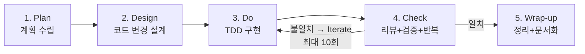
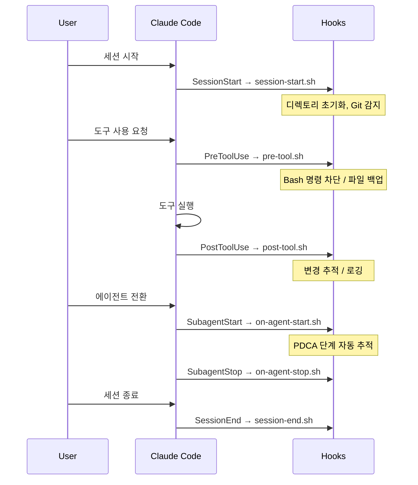

# 아키텍처

## 확장 PDCA 워크플로우



## 에이전트-스킬 관계

```mermaid
graph TB
    subgraph "에이전트 (인지 모드)"
        ST[strategist<br/>CEO/PM]
        AR[architect<br/>기술 리드]
        EN[engineer<br/>구현]
        GU[guardian<br/>감사]
        LI[librarian<br/>문서화]
        DB[debugger<br/>디버깅]
    end
    subgraph "스킬 (실행 작업)"
        PL[/plan]
        DE[/design]
        IM[/implement]
        CH[/check]
        WR[/wrapup]
        DG[/debug]
    end
    ST -.-> PL
    AR -.-> DE
    EN -.-> IM
    GU -.-> CH
    LI -.-> WR
    DB -.-> DG
```

## 훅 라이프사이클



## 런타임 산출물

| 경로 | 내용 |
|:-----|:-----|
| `docs/templates/*.md` | 단계별 산출물 템플릿 파일 |
| `docs/specs/<feature-slug>/` | 실행 시 기능별 산출물 저장소 |
| `~/.harness-engineering/logs/session.log` | 세션 로그 |
| `~/.harness-engineering/logs/security.log` | 차단된 명령 로그 |
| `~/.harness-engineering/state/pdca-phase.txt` | 현재 PDCA 단계 |
| `~/.harness-engineering/state/current-agent.txt` | 현재 에이전트 |
| `~/.harness-engineering/state/changes.txt` | 파일 변경 이력 |
| `~/.harness-engineering/backups/` | 편집 전 백업 |
