# PDCA 기반 AI 소프트웨어 개발 자동화 워크플로우

## 1. 전체 PDCA 사이클

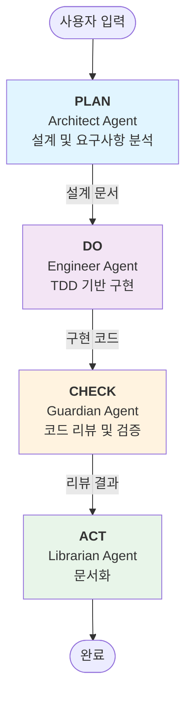

---

## 2. PLAN 단계 상세 (Architect)

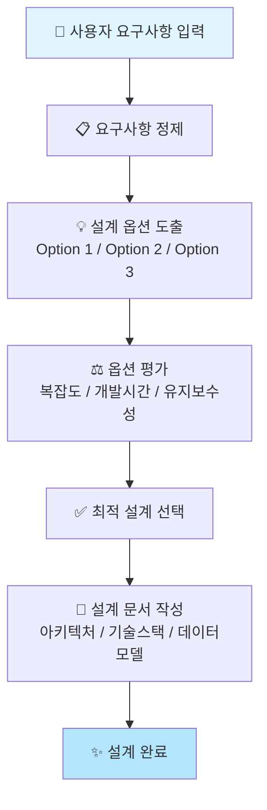

---

## 3. DO 단계 상세 (Engineer)

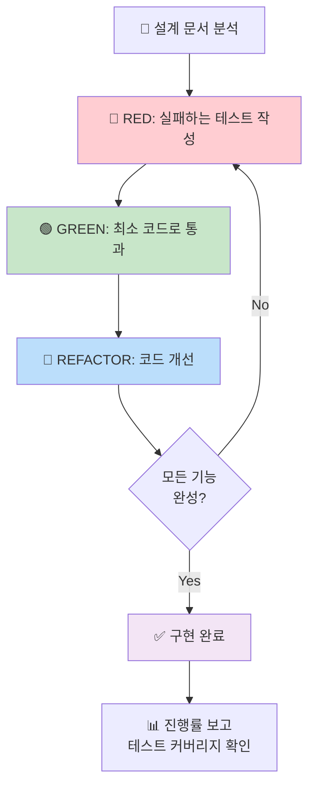

---

## 4. CHECK 단계 상세 (Guardian)

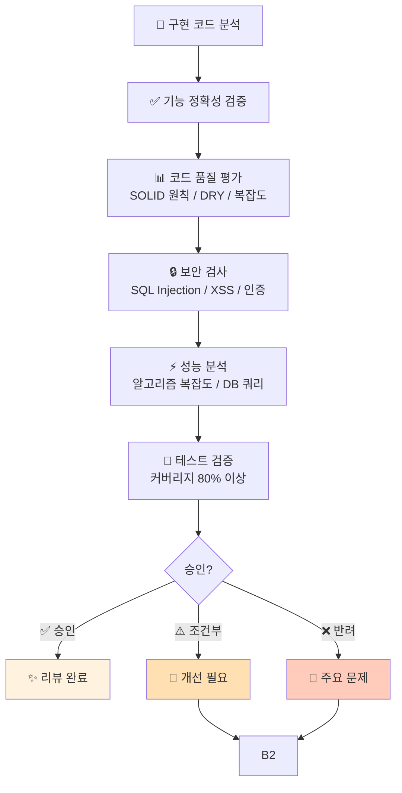

---

## 5. ACT 단계 상세 (Librarian)

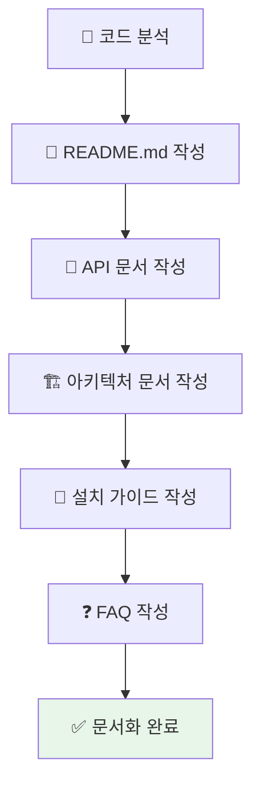

---

## 6. Hook 기반 자동화 흐름

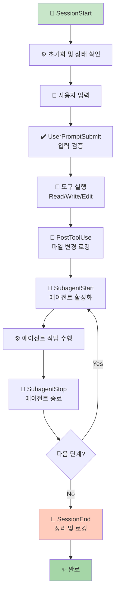

---

## 7. 에이전트 상태 전이도

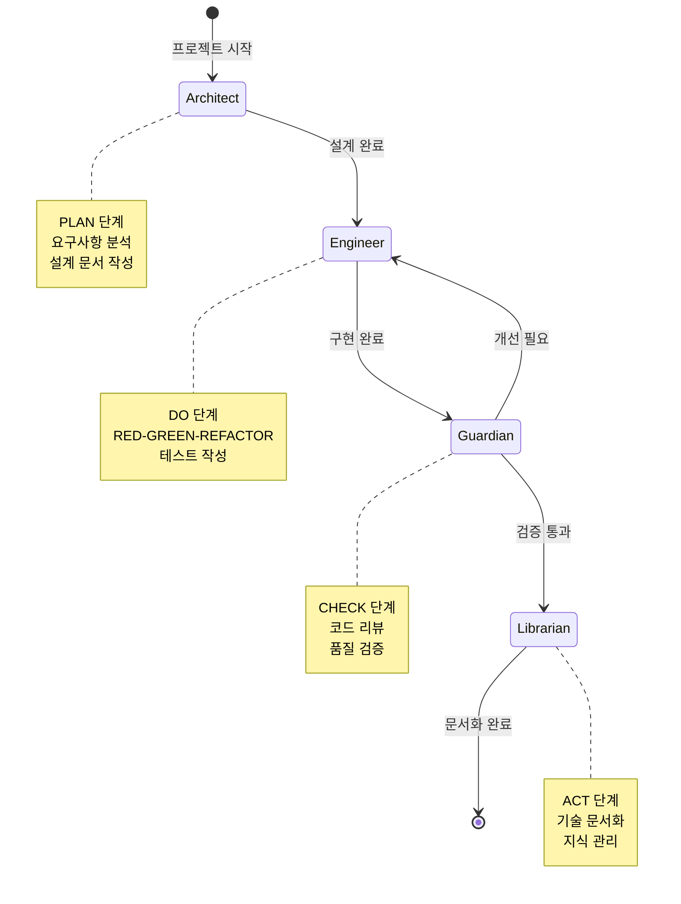

---

## 8. Skill 호출 흐름

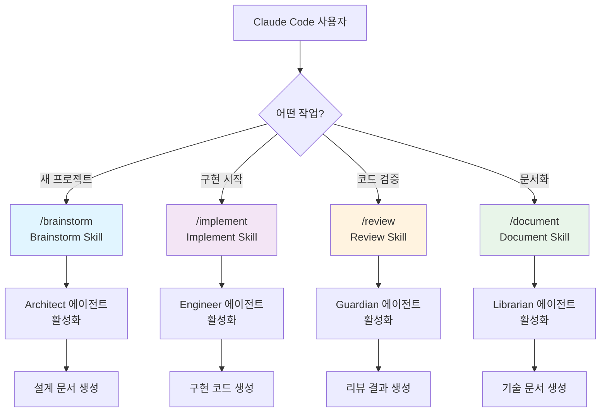

---

## 9. 데이터 흐름

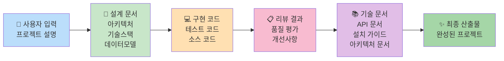

---

## 10. 시간 기반 워크플로우

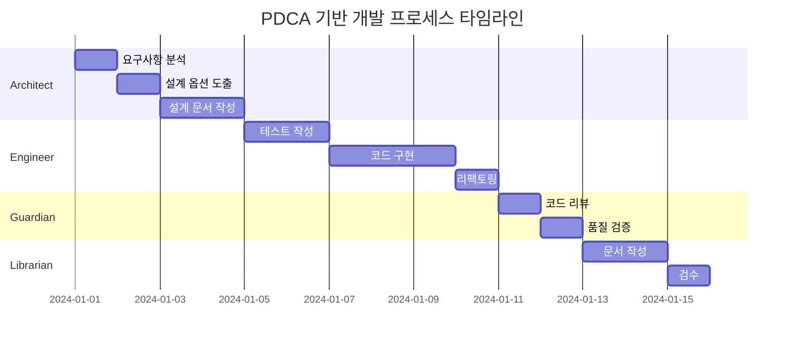

---

## 11. 에러 처리 및 피드백 루프

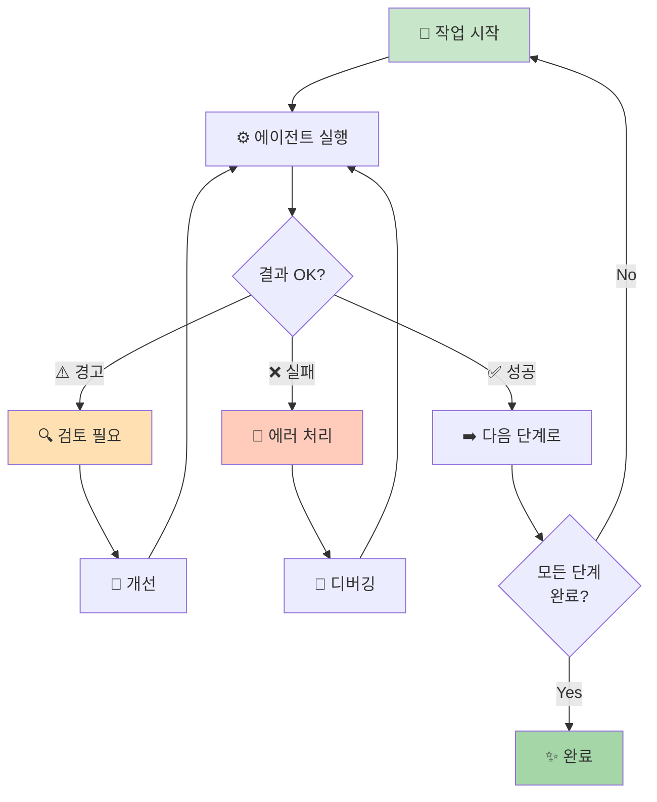

---

## 12. 플러그인 아키텍처

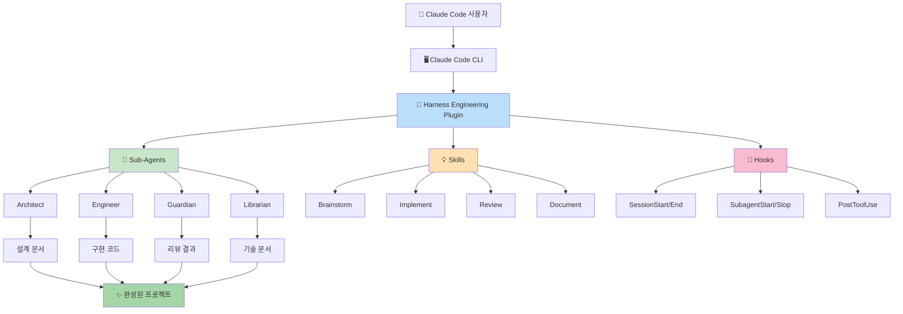

---

## 13. 의사결정 트리

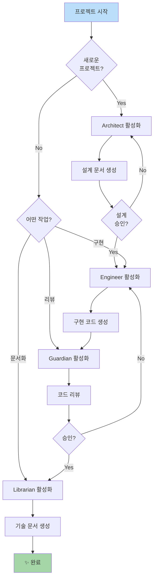

---

## 14. 실시간 로깅 및 모니터링

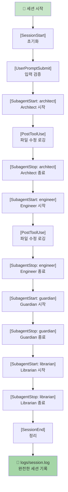

---

## 요약

이 플러그인은 **PDCA 사이클**을 기반으로 다음과 같이 작동합니다:

1. **PLAN (계획)**: Architect가 요구사항을 분석하고 설계 문서를 작성
2. **DO (수행)**: Engineer가 TDD 기반으로 코드를 구현
3. **CHECK (점검)**: Guardian이 코드 품질을 검증하고 리뷰
4. **ACT (조치)**: Librarian이 기술 문서를 작성

각 단계는 **Hooks를 통해 자동으로 연결**되며, **Skills를 통해 개별 작업도 수행** 가능합니다.

모든 활동은 **세션 로그에 기록**되어 완전한 감시와 추적이 가능합니다.
