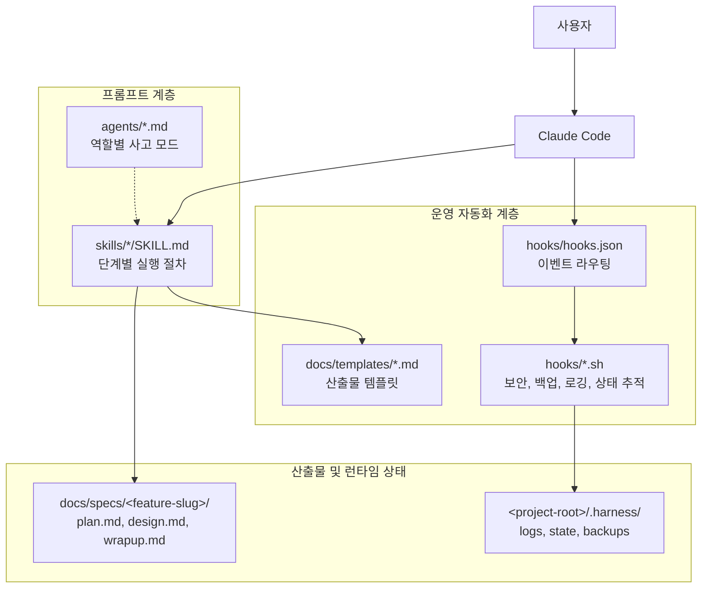
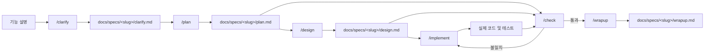
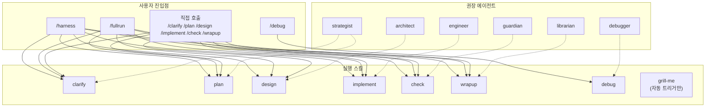
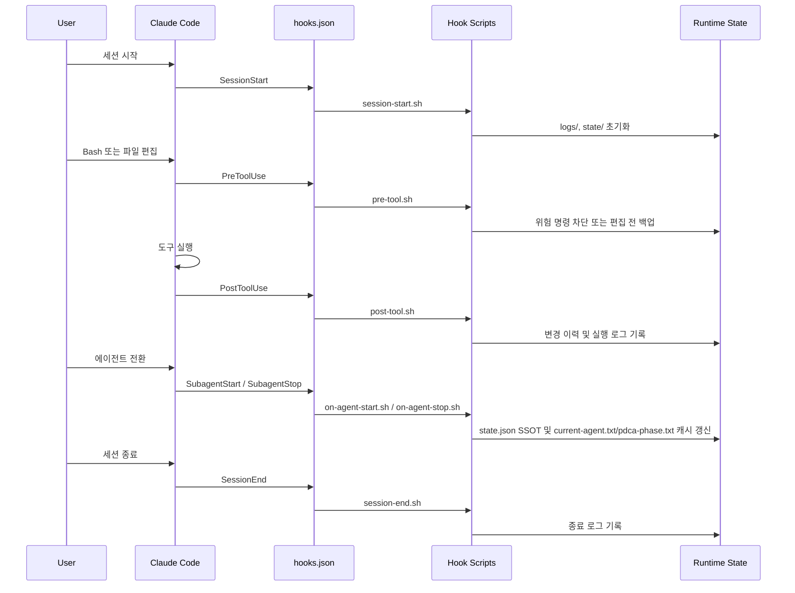

# 아키텍처

Harness Engineering은 Claude Code 위에서 동작하는 **워크플로우 플러그인**입니다. 실행 로직의 중심은 일반 애플리케이션 코드가 아니라, 다음 세 계층의 조합에 있습니다.

- **프롬프트 계층**: `skills/`, `agents/`
- **운영 자동화 계층**: `hooks/hooks.json`, `hooks/`
- **산출물/상태 계층**: `docs/specs/`, `<project-root>/.harness/`

## 0. 핵심 기능 (P0/P1)

### P0 Foundation

| 모듈 | 파일 | 설명 |
|------|------|------|
| **다중 프레임워크 테스트** | `hooks/lib/test-runner.sh` | Jest, Vitest, pytest, go test, cargo test 자동 감지/실행 |
| **검증 클래스** | `hooks/lib/verification-classes.sh` | Class A-D 검증 (정적분석 → E2E) |
| **서브에이전트 스포닝** | `hooks/lib/subagent-spawner.sh` | 독립 서브에이전트 스폰/관리/집계 |
| **상태 머신** | `hooks/lib/state-machine.sh` | PDCA 상태 추적, 스냅샷, 롤백 |

### P1 Enhancement

| 모듈 | 파일 | 설명 |
|------|------|------|
| **2단계 리뷰** | `hooks/lib/review-engine.sh` | 스펙 준수(60%) + 코드 품질(40%) |
| **스킬 평가** | `hooks/lib/skill-evaluation.sh` | 실행 메트릭 수집, 대시보드 생성 |
| **크래시 복구** | `hooks/lib/crash-recovery.sh` | Stuck 감지, 포렌식 리포트, 복구 옵션 |
| **브라우저 테스트** | `hooks/lib/browser-testing.sh` | Playwright/Cypress 통합 |

### P2 Advanced

| 모듈 | 파일 | 설명 |
|------|------|------|
| **해시 앵커 에디트** | `hooks/lib/hash-anchored-edit.sh` | 파일 해시 기반 충돌 방지, 무결성 검증 |
| **웨이브 실행** | `hooks/lib/wave-executor.sh` | 의존성 기반 병렬 실행, 순환 감지 |

## 1. 시스템 개요

### 해석

- 사용자는 Claude Code에 명령을 내리고, 실제 작업 절차는 `skills/`에 정의됩니다.
- `agents/`는 각 단계에서 어떤 관점으로 사고할지를 규정하는 **인지 모드**입니다.
- `hooks/`는 세션, 도구 실행, 에이전트 전환 시점에 개입해 상태 추적과 안전장치를 제공합니다.
- Git 저장소에서는 세션 시작 시 `.harness/`를 `.git/info/exclude`에 등록해 런타임 파일이 커밋 후보에 섞이지 않도록 합니다.

## 2. PDCA 실행 및 산출물 흐름

### 핵심 포인트

- `clarify.md`는 사용자 요청을 구체화한 문서로, Plan 단계의 입력이 됩니다.
- `plan.md`와 `design.md`가 이후 단계의 **고정 입력** 역할을 합니다.
- `implement` 단계는 실제 코드와 테스트를 변경하지만 별도 중간 산출물 문서는 만들지 않습니다.
- `check` 단계도 별도 문서를 생성하지 않고, 계획 대비 검증 후 필요 시 `implement`로 되돌립니다.

## 3. 진입점, 스킬, 에이전트 매핑

### 해석

- `/harness`는 단계별 진입점이고, `/fullrun`은 전체 PDCA 사이클 오케스트레이터입니다.
- `/grill-me`는 plan이나 design 같은 산출물에 대해 철저한 검증 질문을 수행합니다 (자동 트리거만, 명시적 호출 불가).
- 각 스킬은 특정 에이전트와 자연스럽게 짝을 이루지만, 구조적으로는 **느슨하게 결합**되어 있습니다.
- 이 설계 덕분에 개별 단계 실행과 전체 자동 실행을 모두 지원할 수 있습니다.

## 4. 훅 이벤트 라이프사이클

### 훅의 책임

- `session-start.sh`: 로그/상태 디렉토리 준비, Git 브랜치 감지, `state.json` 복구 또는 캐시 초기화
- `session-start.sh`: 필요 시 `.git/info/exclude`에 `.harness/` 등록
- `pre-tool.sh`: 위험 Bash 명령 차단, 파일 편집 전 백업
- `post-tool.sh`: 파일 변경 해시 기록, Bash 실행 로그 기록
- `on-agent-start.sh`: 에이전트와 PDCA 단계를 매핑해 `state.json`과 런타임 캐시를 동기화
- `on-agent-stop.sh`, `session-end.sh`: 세션 종료 흔적 정리

## 5. 저장소와 런타임 상태

| 위치 | 역할 |
|:-----|:-----|
| `agents/*.md` | 역할별 사고 방식과 출력 기대치 정의 |
| `skills/*/SKILL.md` | 사용자 명령별 실행 절차 정의 |
| `hooks/hooks.json` | Claude Code 이벤트와 훅 스크립트 연결 |
| `hooks/*.sh` | 보안, 백업, 로깅, 상태 추적 자동화 |
| `hooks/lib/*.sh` | 훅 라이브러리 모듈 |
| `docs/templates/*.md` | Plan, Design, Wrap-up 문서 골격 |
| `docs/specs/<feature-slug>/` | 기능별 SSOT 산출물 저장소 |
| `<project-root>/.harness/logs/` | 세션 로그, 보안 로그 |
| `<project-root>/.harness/state/` | 현재 PDCA 단계, 에이전트, 변경 이력 |
| `<project-root>/.harness/backups/` | 편집 전 백업 파일 |
| `<project-root>/.harness/engine/` | 상태 머신 엔진 데이터 |
| `<project-root>/.harness/metrics/` | 스킬 평가 메트릭 |
| `<project-root>/.harness/review/` | 2단계 리뷰 결과 |
| `<project-root>/.harness/recovery/` | 복구 체크포인트 |

### 라이브러리 모듈 (hooks/lib/)

| 모듈 | 설명 | 의존성 |
|------|------|--------|
| `json-utils.sh` | JSON 파싱, jq 래퍼 | 없음 |
| `logging.sh` | 구조화된 로깅 | json-utils |
| `validation.sh` | 입력 검증 | json-utils |
| `error-messages.sh` | 사용자 친화적 에러 | logging |
| `context-rot.sh` | 컨텍스트 품질 추적 | json-utils |
| `automation-level.sh` | L0-L4 자동화 레벨 | 없음 |
| `feature-registry.sh` | Feature 메타데이터 관리 | json-utils |
| `cleanup.sh` | 리소스 정리 | 없음 |
| `feature-sync.sh` | Feature 동기화 | feature-registry |
| `skill-chain.sh` | 스킬 체인 실행 | 없음 |
| `result-summary.sh` | 결과 요약 | json-utils |
| `worktree.sh` | Git worktree 관리 | 없음 |
| `doctor.sh` | 시스템 진단 | logging |
| **test-runner.sh** | 다중 프레임워크 테스트 (P0-1) | json-utils |
| **verification-classes.sh** | 검증 클래스 (P0-1) | test-runner |
| **subagent-spawner.sh** | 서브에이전트 스포닝 (P0-2) | json-utils, logging |
| **state-machine.sh** | 상태 머신 엔진 (P0-3) | json-utils, logging |
| **review-engine.sh** | 2단계 리뷰 (P1-1) | subagent-spawner, state-machine |
| **skill-evaluation.sh** | 스킬 평가 (P1-2) | json-utils, logging |
| **crash-recovery.sh** | 크래시 복구 (P1-3) | state-machine, logging |
| **browser-testing.sh** | 브라우저 테스트 (P1-4) | json-utils, logging |
| **hash-anchored-edit.sh** | 해시 앵커 에디트 (P2-1) | json-utils, logging |
| **wave-executor.sh** | 웨이브 실행 (P2-2) | json-utils, logging, subagent-spawner |

## 6. 설계 원칙

- **고정 경로 우선**: 스킬 간 인수인계는 검색보다 `docs/specs/<slug>/` 고정 경로를 사용합니다.
- **프롬프트 중심 오케스트레이션**: 복잡한 런타임 코드 대신 스킬과 에이전트 지침으로 작업 흐름을 제어합니다.
- **얕지만 실용적인 훅 자동화**: 보안 차단, 백업, 로깅, 상태 추적을 Bash 훅으로 가볍게 수행합니다.
- **문서와 실행 흔적 분리**: 기능 산출물은 `docs/specs/`, 런타임 로그와 백업은 `.harness/`에 분리해 보관합니다.
