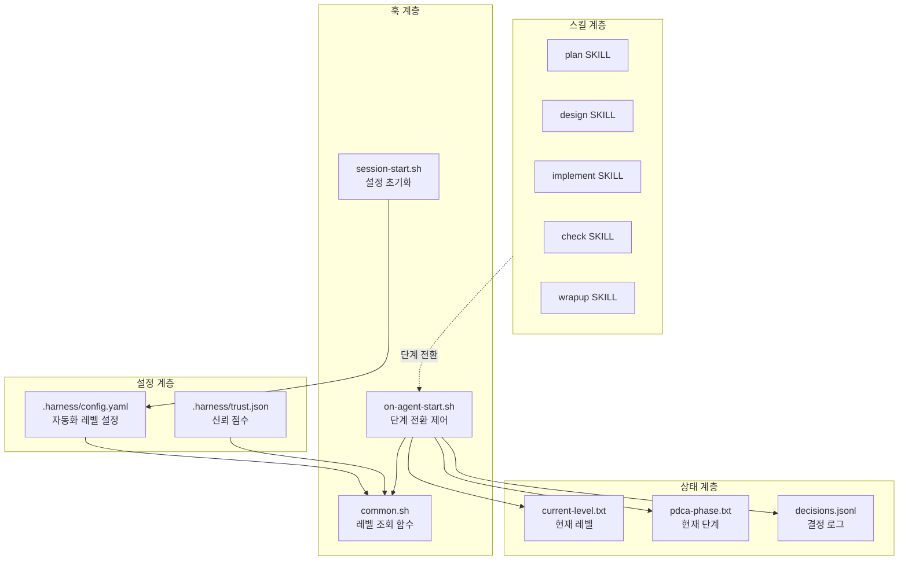

# Automation Levels (L0-L4) 설계 문서 (Design)

## 1. 아키텍처 개요

### 시스템 구조



### 자동화 레벨별 동작

| 레벨 | 이름 | Plan→Design | Design→Do | Do→Check | Check→Wrapup | 설명 |
|:----:|:-----|:-----------:|:---------:|:--------:|:------------:|:-----|
| L0 | Manual | 승인 | 승인 | 승인 | 승인 | 모든 전환에 사용자 승인 필수 |
| L1 | Guided | 승인 | 승인 | 승인 | 자동 | 중요 전환만 승인 |
| L2 | Semi-Auto | 불확실시 승인 | 자동 | 자동 | 자동 | 기본값, 불확실할 때만 승인 |
| L3 | Auto | 자동 | 자동 | 게이트 | 자동 | 품질 게이트만 통과하면 자동 |
| L4 | Full-Auto | 자동 | 자동 | 자동 | 자동 | 완전 자동, 요약만 제공 |

### 신뢰 점수 계산

```
trust_score = (track_record × 0.25)
            + (quality_metrics × 0.20)
            + (velocity × 0.15)
            + (user_ratings × 0.20)
            + (decision_accuracy × 0.10)
            + (safety × 0.10)

범위: 0.0 ~ 1.0
- 0.0~0.3: L0-L1 권장
- 0.3~0.6: L2 권장
- 0.6~0.8: L3 권장
- 0.8~1.0: L4 권장
```

---

## 2. 비판적 검토 (Adversarial Review)

### 2.1. 도출된 문제점 및 해결 방안

| 문제점 | 영향도 | 해결 방안 |
|:-------|:-------|:---------|
| **yq 의존성**: YAML 파싱을 위해 yq가 필요하나 모든 환경에 설치되어 있지 않음 | High | yq 없으면 기본값(L2) 사용, jq만으로 JSON 신뢰 점수 처리 |
| **설정 파일 손상**: config.yaml이 손상되거나 잘못된 값이 있을 경우 | High | 검증 로직 추가, 손상 시 L2로 폴백 |
| **동시성 문제**: 여러 에이전트가 동시에 상태를 변경할 가능성 | Medium | 파일 잠금 대신 append-only 로그 사용, 상태 파일은 단일 writer |
| **신뢰 점수 초기화**: 첫 사용 시 신뢰 점수가 없어 레벨 결정 불가 | Medium | 기본값 0.5로 초기화, L2부터 시작 |
| **승인 요청 UX**: 훅에서 사용자에게 승인을 요청하는 방법 제한적 | Medium | 상태 파일에 pending_approval 플래그 설정, 스킬에서 확인 |
| **레벨 변경 즉시 반영**: 설정 변경 후 재시작 없이 반영 필요 | Low | 매 이벤트마다 설정 파일 재조회 |

### 2.2. 추가 검토 필요 사항

- [ ] L3 품질 게이트 구체적 조건 정의 (test coverage, lint 등)
- [ ] 신뢰 점수 갱신 주기 및 데이터 소스 구체화
- [ ] 사용자 피드백 수집 방법 (user_ratings 지표)
- [ ] Emergency Stop 구현 방식 (L4에서도 동작해야 함)

---

## 3. 영향 범위 (Impact Analysis)

### 수정될 주요 모듈/파일

| 모듈/파일 | 영향도 | 설명 |
|:---------|:------|:-----|
| `hooks/common.sh` | High | 자동화 레벨 조회 함수 추가, 신뢰 점수 계산 함수 추가 |
| `hooks/session-start.sh` | High | 설정 파일 초기화, 기본값 생성 |
| `hooks/on-agent-start.sh` | High | 단계 전환 시 승인 로직 추가 |
| `.harness/config.yaml` | High | 신규 생성, 자동화 설정 저장 |
| `.harness/trust.json` | Medium | 신규 생성, 신뢰 점수 저장 |
| `.harness/logs/decisions.jsonl` | Medium | 신규 생성, 결정 로그 |

### 다른 기능과의 충돌 가능성

- **기존 PDCA 워크플로우**: L2 기본값으로 기존 동작과 동일하게 유지하여 충돌 최소화
- **의존성 확인 로직**: 기존 `check_dependency_conflicts` 함수와 독립적으로 동작
- **파일 백업**: pre-tool.sh의 백업 로직과 무관하게 동작

---

## 4. 기술 결정 및 의존성 (Technical Decisions & Dependencies)

### 기술 결정

| 결정사항 | 이유/근거 |
|:---------|:----------|
| **YAML 대신 JSON 일부 사용** | 신뢰 점수는 jq로 쉽게 처리하기 위해 JSON 사용 |
| **yq 선택적 의존성** | 필수가 아님, 없으면 기본값 사용 |
| **파일 기반 상태 관리** | Claude Code hooks의 제약상 파일 시스템만 사용 가능 |
| **승인 플래그 방식** | 훅에서 직접 사용자 입력이 어려워 상태 파일 활용 |
| **append-only 로그** | 동시성 문제 회피, 감사 추적 가능 |

### 선행 완료 기능

- [ ] 없음 (현재 harness-engineering 기본 기능 활용)

### 외부 의존성

| 의존성 | 필수 여부 | 용도 |
|:-------|:---------:|:-----|
| `jq` | 필수 | JSON 파싱 (기존 사용 중) |
| `yq` | 선택 | YAML 파싱, 없으면 기본값 사용 |

---

## 5. 파일 변경 계획 (File Changes)

### 🟢 생성 (Create)

| 파일 경로 | 역할 | 핵심 내용 |
|:---------|:-----|:---------|
| `.harness/config.yaml` | 자동화 설정 | automation.level, trust.enabled, escalation 설정 |
| `.harness/trust.json` | 신뢰 점수 | 6개 지표별 점수 및 종합 점수 |
| `.harness/logs/decisions.jsonl` | 결정 로그 | 승인/자동 진행 결정 기록 |

### 🟡 수정 (Modify)

| 파일 경로 | 기존 대비 주요 변경 사항 |
|:---------|:---------------------|
| `hooks/common.sh` | `get_automation_level()`, `get_trust_score()`, `calculate_trust_score()`, `should_approve()` 함수 추가 |
| `hooks/session-start.sh` | 설정 파일 존재 확인 및 기본값 생성 로직 추가 |
| `hooks/on-agent-start.sh` | 단계 전환 시 `should_approve()` 호출 및 pending 플래그 설정 |

### 🔴 삭제 (Delete)

| 파일 경로 | 삭제 이유 |
|:---------|:--------|
| 없음 | - |

---

## 6. 테스트 전략 (Test Strategy)

### 단위 테스트

| 테스트 대상 | 검증 방식 |
|:-----------|:---------|
| `get_automation_level()` | config.yaml 유무, 올바른/잘못된 값, yq 유무별 동작 |
| `calculate_trust_score()` | 각 지표 조합별 점수 계산 검증 |
| `should_approve()` | 각 레벨별 PDCA 전환 승인 여부 |

### 통합/E2E 테스트

| 테스트 시나리오 | 검증 포인트 |
|:---------------|:-----------|
| L0에서 전체 PDCA 사이클 | 모든 전환에서 승인 요청 |
| L4에서 전체 PDCA 사이클 | 모든 전환 자동 진행 |
| 신뢰 점수 기반 레벨 조정 | 점수 변화에 따른 레벨 변경 |
| 설정 파일 손상 복구 | L2 폴백 동작 |

### 수동 테스트 체크리스트

- [ ] 새 프로젝트에서 `/plan` 실행 시 config.yaml 자동 생성
- [ ] L0 설정 후 각 단계 전환에서 승인 요청 확인
- [ ] L4 설정 후 자동 진행 확인
- [ ] config.yaml 수동 편집 후 즉시 반영 확인

---

## 7. 구현 순서 (Implementation Steps)

### Phase 1: 기본 인프라 (1-2)
1. **`hooks/common.sh` 확장**
   - `get_automation_level()` 함수 구현
   - `init_automation_config()` 함수 구현
   - 기본값 상수 정의

2. **`hooks/session-start.sh` 수정**
   - 설정 파일 존재 확인
   - 기본 config.yaml 생성
   - current-level.txt 초기화

### Phase 2: 승인 로직 (3-4)
3. **`hooks/on-agent-start.sh` 수정**
   - `should_approve()` 함수 호출
   - pending_approval 플래그 설정
   - 결정 로그 기록

4. **승인 요청 메커니즘**
   - 상태 파일 기반 승인 대기
   - 스킬에서 승인 확인 후 진행

### Phase 3: 신뢰 점수 (5-6)
5. **신뢰 점수 시스템**
   - `trust.json` 구조 정의
   - `calculate_trust_score()` 구현
   - `update_trust_score()` 구현

6. **자동 레벨 조정**
   - autoEscalation 로직
   - autoDowngrade 로직
   - 임계값 기반 조정

### Phase 4: 통합 및 검증 (7-8)
7. **통합 테스트**
   - 각 레벨별 E2E 테스트
   - 엣지 케이스 검증

8. **문서화**
   - 사용자 가이드 작성
   - 설정 예시 추가

---

## 8. 상세 구현 명세

### 8.1. config.yaml 구조

```yaml
# .harness/config.yaml
automation:
  level: L2  # L0, L1, L2, L3, L4
  default_level: L2

  levels:
    L0_manual:
      plan_to_design: approve
      design_to_do: approve
      do_to_check: approve
      check_to_wrapup: approve
    L1_guided:
      plan_to_design: approve
      design_to_do: approve
      do_to_check: approve
      check_to_wrapup: auto
    L2_semi_auto:
      plan_to_design: approve_if_uncertain
      design_to_do: auto
      do_to_check: auto
      check_to_wrapup: auto
    L3_auto:
      plan_to_design: auto
      design_to_do: auto
      do_to_check: gate  # 품질 게이트 통과 시 자동
      check_to_wrapup: auto
      gates:
        - test_coverage >= 80
        - no_critical_issues
    L4_full_auto:
      plan_to_design: auto
      design_to_do: auto
      do_to_check: auto
      check_to_wrapup: auto
      emergency_stop: true

trust:
  enabled: true
  auto_escalation: false
  auto_downgrade: true
  escalation_threshold: 0.8
  downgrade_threshold: 0.3
```

### 8.2. trust.json 구조

```json
{
  "version": "1.0",
  "updated_at": "2026-03-24T10:00:00Z",
  "scores": {
    "track_record": 0.75,
    "quality_metrics": 0.80,
    "velocity": 0.70,
    "user_ratings": 0.85,
    "decision_accuracy": 0.90,
    "safety": 1.00
  },
  "composite": 0.82,
  "history": [
    {
      "timestamp": "2026-03-24T09:00:00Z",
      "event": "check_passed",
      "delta": 0.02
    }
  ]
}
```

### 8.3. decisions.jsonl 포맷

```json
{"timestamp":"2026-03-24T10:30:00Z","event":"phase_transition","from":"plan","to":"design","level":"L2","action":"auto","reason":"design_to_do is auto in L2"}
{"timestamp":"2026-03-24T10:35:00Z","event":"phase_transition","from":"design","to":"do","level":"L2","action":"pending_approval","reason":"plan_to_design requires approval if uncertain"}
{"timestamp":"2026-03-24T10:40:00Z","event":"approval","phase":"design_to_do","approved":true,"approver":"user"}
```

### 8.4. common.sh 추가 함수

```bash
# 자동화 레벨 조회
get_automation_level() {
  local project_root="${1:-}"
  local config_file="${project_root}/.harness/config.yaml"
  local default_level="L2"

  if [[ ! -f "$config_file" ]]; then
    echo "$default_level"
    return 0
  fi

  if command -v yq &>/dev/null; then
    local level
    level=$(yq '.automation.level // "'"$default_level"'"' "$config_file" 2>/dev/null)
    echo "$level"
  else
    echo "$default_level"
  fi
}

# 단계 전환 승인 필요 여부
should_approve() {
  local level="${1:-L2}"
  local transition="${2:-}"  # plan_to_design, design_to_do, etc.

  case "$level" in
    L0) echo "true" ;;
    L1)
      case "$transition" in
        check_to_wrapup) echo "false" ;;
        *) echo "true" ;;
      esac
      ;;
    L2)
      case "$transition" in
        plan_to_design) echo "if_uncertain" ;;
        *) echo "false" ;;
      esac
      ;;
    L3|L4) echo "false" ;;
    *) echo "false" ;;
  esac
}

# 신뢰 점수 계산
calculate_trust_score() {
  local project_root="${1:-}"
  local trust_file="${project_root}/.harness/trust.json"

  if [[ ! -f "$trust_file" ]]; then
    echo "0.5"  # 기본값
    return 0
  fi

  if command -v jq &>/dev/null; then
    jq -r '.composite // 0.5' "$trust_file" 2>/dev/null || echo "0.5"
  else
    echo "0.5"
  fi
}
```
