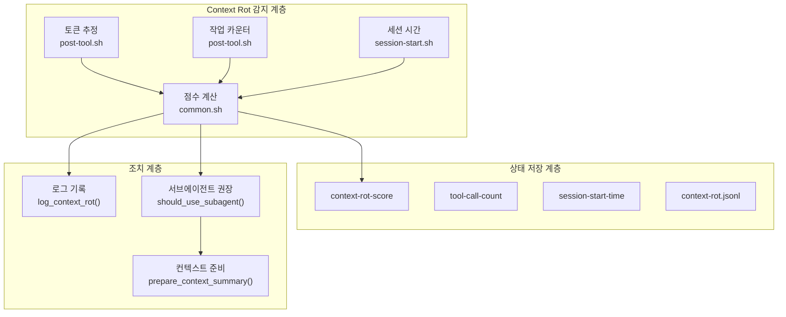

# Fresh Context (Context Rot 방지) 설계 문서 (Design)

## 1. 아키텍처 개요

### 시스템 구조



### Context Rot 점수 계산 공식

```
context_rot_score = (token_ratio × 0.4) + (task_ratio × 0.3) + (time_ratio × 0.3)

where:
  token_ratio = estimated_tokens / 200000   (0.0 ~ 1.0)
  task_ratio = tool_calls / 50              (0.0 ~ 1.0)
  time_ratio = session_minutes / 60         (0.0 ~ 1.0)

등급:
  < 0.5: 건강함 (Healthy)
  0.5 ~ 0.7: 주의 (Caution)
  >= 0.7: Context Rot (서브에이전트 권장)
```

---

## 2. 비판적 검토 (Adversarial Review)

### 2.1. 도출된 문제점 및 해결 방안

| 문제점 | 영향도 | 해결 방안 |
|:-------|:-------|:---------|
| **토큰 직접 조회 불가**: Claude Code API에서 현재 토큰 사용량을 직접 가져올 수 없음 | High | 도구 호출 기반 추정 (평균 500토큰/호출) + 파일 크기 기반 보정 |
| **세션 시간 정밀도**: Bash date 명령의 초 단위 한계 | Low | epoch time 사용으로 충분한 정밀도 확보 |
| **점수 계산 오버헤드**: 매 도구 호출마다 점수 계산 시 성능 저하 | Medium | 캐시 도입 (마지막 계산 후 5초 내 재사용) |
| **서브에이전트 호출 시점**: 점수만으로는 실제 호출 여부 결정 어려웅 | Medium | should_use_subagent() 함수로 권장만 제공, 실제 호출은 스킬에서 결정 |
| **컨텍스트 요약 품질**: 자동 생성된 요약이 서브에이전트에 충분하지 않을 수 있음 | Medium | STATE.md 템플릿으로 일관성 확보 |

### 2.2. 추가 검토 필요 사항

- [ ] 토큰 추정 정확도 검증 (실제 사용량과 비교)
- [ ] 점수 임계값 조정 (사용자 피드백 기반)
- [ ] 서브에이전트 호출 시 전달할 컨텍스트 최적화

---

## 3. 영향 범위 (Impact Analysis)

### 수정될 주요 모듈/파일

| 모듈/파일 | 영향도 | 설명 |
|:---------|:------:|:-----|
| `hooks/common.sh` | High | Context Rot 감지 및 점수 계산 함수 추가 |
| `hooks/session-start.sh` | Medium | 세션 시작 시간 기록 추가 |
| `hooks/post-tool.sh` | Medium | 도구 호출 카운터 증가 로직 추가 |
| `.harness/state/` | Medium | 새 상태 파일 추가 |
| `.harness/logs/` | Low | context-rot.jsonl 로그 추가 |
| `.harness/context/` | Medium | PROJECT.md, STATE.md 템플릿 추가 |

### 기존 시스템과의 통합

- **automation-levels**: 신뢰 점수와 Context Rot 점수를 함께 고려
- **서브에이전트**: Agent 도구 호출 시 컨텍스트 요약 전달 가이드 추가

---

## 4. 기술 결정 및 의존성 (Technical Decisions & Dependencies)

### 기술 결정

| 결정사항 | 이유/근거 |
|:---------|:----------|
| **토큰 추정 방식**: 도구 호출 × 500토큰 | Claude Code에서 직접 조회 불가, 평균값 기반 추정 |
| **점수 캐시**: 5초 TTL | 성능 저하 방지, 충분한 실시간성 |
| **로그 포맷**: JSONL | 기존 decisions.jsonl과 동일한 형식 |
| **상태 파일**: 텍스트 + JSON 혼합 | 간단한 값은 텍스트, 복잡한 데이터는 JSON |

### 선행 완료 기능

- [x] `automation-levels`: L0-L4 자동화 레벨 시스템 (완료)

### 외부 의존성

| 의존성 | 필수 여부 | 용도 |
|:-------|:---------:|:-----|
| `jq` | 필수 | JSON 파싱 (기존 사용 중) |
| `awk` | 필수 | 부동소수점 계산 |
| `date` | 필수 | 시간 계산 |

---

## 5. 파일 변경 계획 (File Changes)

### 🟢 생성 (Create)

| 파일 경로 | 역할 | 핵심 내용 |
|:---------|:-----|:---------|
| `.harness/state/session-start-time` | 세션 시작 시간 | epoch timestamp |
| `.harness/state/tool-call-count` | 도구 호출 횟수 | 정수 카운터 |
| `.harness/state/context-rot-score` | Context Rot 점수 | 0.0 ~ 1.0 |
| `.harness/logs/context-rot.jsonl` | Context Rot 이벤트 로그 | JSONL 포맷 |
| `.harness/context/PROJECT.md` | 프로젝트 컨텍스트 | 템플릿 |
| `.harness/context/STATE.md` | 현재 상태 요약 | 템플릿 |
| `docs/templates/context-summary.md` | 컨텍스트 요약 템플릿 | 가이드 |

### 🟡 수정 (Modify)

| 파일 경로 | 기존 대비 주요 변경 사항 |
|:---------|:---------------------|
| `hooks/common.sh` | `calculate_context_rot()`, `get_context_rot_score()`, `should_use_subagent()`, `prepare_context_summary()` 함수 추가 |
| `hooks/session-start.sh` | 세션 시작 시간 기록 로직 추가 |
| `hooks/post-tool.sh` | 도구 호출 카운터 증가 로직 추가 |

### 🔴 삭제 (Delete)

| 파일 경로 | 삭제 이유 |
|:---------|:--------|
| 없음 | - |

---

## 6. 테스트 전략 (Test Strategy)

### 단위 테스트

| 테스트 대상 | 검증 방식 |
|:-----------|:---------|
| `calculate_context_rot()` | 다양한 입력값에 대한 점수 계산 검증 |
| `get_context_rot_score()` | 캐시 동작 및 파일 읽기 검증 |
| `should_use_subagent()` | 임계값 기반 권장 여부 검증 |

### 통합 테스트

| 테스트 시나리오 | 검증 포인트 |
|:---------------|:-----------|
| 긴 세션 시뮬레이션 | 60분+ 세션에서 점수 증가 |
| 다수 도구 호출 | 50회+ 호출에서 점수 증가 |
| 세션 재시작 | 상태 파일 초기화 확인 |

### 수동 테스트 체크리스트

- [ ] 새 세션에서 점수 0.0으로 시작
- [ ] 도구 호출 시 점수 점진적 증가
- [ ] 0.7 이상 시 로그 기록
- [ ] 로그에서 Context Rot 이벤트 확인

---

## 7. 구현 순서 (Implementation Steps)

### Phase 1: 상태 파일 및 초기화 (1-2)
1. **`hooks/common.sh` 확장**
   - `calculate_context_rot()` 함수 구현
   - `get_context_rot_score()` 함수 구현
   - `should_use_subagent()` 함수 구현

2. **`hooks/session-start.sh` 수정**
   - 세션 시작 시간 기록
   - 도구 호출 카운터 초기화
   - Context Rot 점수 초기화

### Phase 2: 실시간 추적 (3)
3. **`hooks/post-tool.sh` 수정**
   - 도구 호출 카운터 증가
   - Context Rot 점수 재계산
   - 임계값 초과 시 로그 기록

### Phase 3: 컨텍스트 관리 (4-5)
4. **컨텍스트 템플릿 생성**
   - `docs/templates/context-summary.md`
   - `.harness/context/PROJECT.md`
   - `.harness/context/STATE.md`

5. **컨텍스트 준비 함수**
   - `prepare_context_summary()` 구현
   - `get_project_context()` 구현

---

## 8. 상세 구현 명세

### 8.1. common.sh 추가 함수

```bash
# ============================================================================
# Context Rot 방지 관련 헬퍼 함수
# ============================================================================

# 토큰 추정 상수
readonly AVG_TOKENS_PER_TOOL_CALL=500
readonly MAX_CONTEXT_TOKENS=200000
readonly CONTEXT_ROT_CACHE_TTL=5

# 세션 시작 시간 기록
# Usage: record_session_start <project_root>
record_session_start() {
  local project_root="${1:-}"
  local state_dir="${project_root}/.harness/state"
  local now_epoch

  mkdir -p "$state_dir"

  now_epoch=$(date +%s)
  echo "$now_epoch" > "${state_dir}/session-start-time"
  echo "0" > "${state_dir}/tool-call-count"
  echo "0.0" > "${state_dir}/context-rot-score"
  echo "$now_epoch" > "${state_dir}/context-rot-last-calc"
}

# 도구 호출 카운터 증가
# Usage: increment_tool_call_count <project_root>
increment_tool_call_count() {
  local project_root="${1:-}"
  local state_dir="${project_root}/.harness/state"
  local count_file="${state_dir}/tool-call-count"

  mkdir -p "$state_dir"

  local count=0
  if [[ -f "$count_file" ]]; then
    count=$(cat "$count_file" 2>/dev/null || echo "0")
  fi

  echo $((count + 1)) > "$count_file"
}

# Context Rot 점수 계산
# Usage: calculate_context_rot <project_root>
# Returns: 0.0 ~ 1.0
calculate_context_rot() {
  local project_root="${1:-}"
  local state_dir="${project_root}/.harness/state"

  # 캐시 확인 (5초 TTL)
  local cache_file="${state_dir}/context-rot-last-calc"
  local score_file="${state_dir}/context-rot-score"
  local now_epoch=$(date +%s)

  if [[ -f "$cache_file" ]] && [[ -f "$score_file" ]]; then
    local last_calc=$(cat "$cache_file" 2>/dev/null || echo "0")
    local elapsed=$((now_epoch - last_calc))
    if [[ $elapsed -lt $CONTEXT_ROT_CACHE_TTL ]]; then
      cat "$score_file"
      return 0
    fi
  fi

  # 구성 요소 계산
  local tool_calls=0
  local session_start=0

  if [[ -f "${state_dir}/tool-call-count" ]]; then
    tool_calls=$(cat "${state_dir}/tool-call-count" 2>/dev/null || echo "0")
  fi

  if [[ -f "${state_dir}/session-start-time" ]]; then
    session_start=$(cat "${state_dir}/session-start-time" 2>/dev/null || echo "$now_epoch")
  fi

  local session_minutes=$(( (now_epoch - session_start) / 60 ))

  # 비율 계산 (0.0 ~ 1.0)
  local token_ratio=$(awk -v calls="$tool_calls" -v avg="$AVG_TOKENS_PER_TOOL_CALL" -v max="$MAX_CONTEXT_TOKENS" 'BEGIN {
    ratio = (calls * avg) / max
    if (ratio > 1.0) ratio = 1.0
    printf "%.4f", ratio
  }')

  local task_ratio=$(awk -v calls="$tool_calls" -v max_calls="50" 'BEGIN {
    ratio = calls / max_calls
    if (ratio > 1.0) ratio = 1.0
    printf "%.4f", ratio
  }')

  local time_ratio=$(awk -v minutes="$session_minutes" -v max_minutes="60" 'BEGIN {
    ratio = minutes / max_minutes
    if (ratio > 1.0) ratio = 1.0
    printf "%.4f", ratio
  }')

  # 가중 평균
  local score=$(awk -v t="$token_ratio" -v k="$task_ratio" -v m="$time_ratio" 'BEGIN {
    score = (t * 0.4) + (k * 0.3) + (m * 0.3)
    printf "%.4f", score
  }')

  # 상태 파일 업데이트
  echo "$score" > "$score_file"
  echo "$now_epoch" > "$cache_file"

  echo "$score"
}

# Context Rot 점수 조회
# Usage: get_context_rot_score <project_root>
# Returns: 0.0 ~ 1.0
get_context_rot_score() {
  local project_root="${1:-}"
  calculate_context_rot "$project_root"
}

# 서브에이전트 사용 권장 여부
# Usage: should_use_subagent <project_root>
# Returns: true or false
should_use_subagent() {
  local project_root="${1:-}"
  local threshold="${2:-0.7}"
  local score
  score=$(calculate_context_rot "$project_root")

  local result=$(awk -v score="$score" -v thresh="$threshold" 'BEGIN {
    if (score >= thresh) print "true"
    else print "false"
  }')

  echo "$result"
}

# Context Rot 등급 조회
# Usage: get_context_rot_grade <project_root>
# Returns: healthy, caution, rot
get_context_rot_grade() {
  local project_root="${1:-}"
  local score
  score=$(calculate_context_rot "$project_root")

  local grade=$(awk -v score="$score" 'BEGIN {
    if (score < 0.5) print "healthy"
    else if (score < 0.7) print "caution"
    else print "rot"
  }')

  echo "$grade"
}

# Context Rot 이벤트 로그
# Usage: log_context_rot_event <project_root> <event_type> <details>
log_context_rot_event() {
  local project_root="${1:-}"
  local event_type="${2:-}"
  local details="${3:-}"
  local log_dir="${project_root}/.harness/logs"
  local log_file="${log_dir}/context-rot.jsonl"

  mkdir -p "$log_dir"

  local timestamp
  timestamp=$(date -u '+%Y-%m-%dT%H:%M:%SZ')

  local score
  score=$(calculate_context_rot "$project_root")

  local log_entry
  log_entry=$(printf '{"timestamp":"%s","event":"%s","score":%.4f,%s}' \
    "$timestamp" "$event_type" "$score" "${details:-\"\"}")

  echo "$log_entry" >> "$log_file"
}
```

### 8.2. session-start.sh 수정

```bash
# Context Rot 추적 초기화
record_session_start "$PROJECT_ROOT"

# Context Rot 상태 로그
CURRENT_SCORE=$(get_context_rot_score "$PROJECT_ROOT")
echo "[$TIMESTAMP] CONTEXT_ROT_SCORE=$CURRENT_SCORE" >> "$SESSION_LOG"
```

### 8.3. post-tool.sh 수정

```bash
# 도구 호출 카운터 증가
increment_tool_call_count "$PROJECT_ROOT"

# Context Rot 점수 재계산
SCORE=$(calculate_context_rot "$PROJECT_ROOT")
GRADE=$(get_context_rot_grade "$PROJECT_ROOT")

# 임계값 초과 시 로그
if [[ "$GRADE" == "rot" ]]; then
  log_context_rot_event "$PROJECT_ROOT" "context_rot_detected" \
    "\"grade\":\"$GRADE\",\"tool_calls\":$(cat "${STATE_DIR}/tool-call-count" 2>/dev/null || echo "0")"
fi
```

### 8.4. 상태 파일 구조

```
.harness/
├── state/
│   ├── session-start-time     # epoch timestamp (예: 1711288800)
│   ├── tool-call-count        # 정수 (예: 42)
│   ├── context-rot-score      # 0.0~1.0 (예: 0.6523)
│   └── context-rot-last-calc  # 마지막 계산 시간 (epoch)
├── logs/
│   └── context-rot.jsonl      # 이벤트 로그
└── context/
    ├── PROJECT.md             # 프로젝트 개요
    └── STATE.md               # 현재 작업 상태
```

### 8.5. context-rot.jsonl 예시

```json
{"timestamp":"2026-03-25T10:30:00Z","event":"context_rot_detected","score":0.7234,"grade":"rot","tool_calls":52}
{"timestamp":"2026-03-25T10:35:00Z","event":"subagent_recommended","score":0.7891,"grade":"rot","tool_calls":58}
```

---

## 9. 서브에이전트 컨텍스트 전달 가이드

Context Rot이 감지되면 서브에이전트 호출 시 다음 컨텍스트를 전달합니다:

### 9.1. PROJECT.md 템플릿

```markdown
# 프로젝트 컨텍스트

## 프로젝트명
[프로젝트 이름]

## 기술 스택
- 언어: [예: TypeScript, Python]
- 프레임워크: [예: Next.js, FastAPI]
- 데이터베이스: [예: PostgreSQL]

## 디렉토리 구조
[src/ - 소스 코드]
[tests/ - 테스트]
[docs/ - 문서]

## 코딩 컨벤션
- [컨벤션 1]
- [컨벤션 2]
```

### 9.2. STATE.md 템플릿

```markdown
# 현재 상태

## 작업 중인 기능
[feature-slug]

## 현재 PDCA 단계
[plan|design|implement|check|wrapup]

## 완료된 작업
- [x] 작업 1
- [x] 작업 2

## 진행 중인 작업
- [ ] 현재 작업

## 다음 작업
- [ ] 다음 작업 1
- [ ] 다음 작업 2

## 주의사항
[알아야 할 사항]
```

---

## 10. 다음 단계

➡️ **Implement 단계**: `/implement fresh-context` 로 TDD 구현을 시작하세요.
