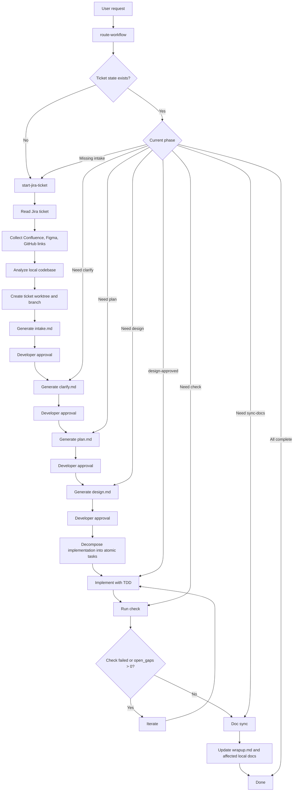
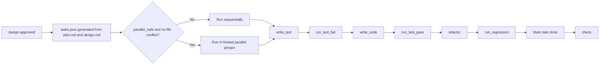

# Workflow

`colo-fe-flow`의 기본 목적은 Jira 티켓을 시작점으로 삼아, 필요한 컨텍스트를 보강하고 승인 게이트를 통과한 뒤 구현과 검증, 문서 동기화까지 강제하는 것입니다.

`route-workflow`의 상세 계약은 [route-workflow-contract.md](./route-workflow-contract.md) 를 기준으로 봅니다.

## Current Scaffold Status

아래 Main Flow는 목표 workflow를 설명합니다. 현재 저장소의 스캐폴드는 이 흐름을 모두 자동 연결한 상태는 아닙니다.

- 현재 `route-workflow`는 다음 skill을 계산해서 JSON으로 반환합니다.
- 현재 bootstrap, planning chain, execution loop는 `hooks/lib/*.sh` helper 중심으로 먼저 구현되어 있습니다.
- 현재 skill 간 실제 end-to-end 자동 handoff와 agent orchestration runner는 아직 남아 있습니다.

## Main Flow

## Intent

- 목표 runtime의 entry point는 `route-workflow`입니다.
- Work starts from Jira and is enriched by Confluence, Figma, and the local codebase.
- `clarify -> plan -> design -> implement -> check -> iterate -> sync-docs` is enforced.
- Stage jumping is blocked.
- `done` is forbidden before verification and local docs sync.

현재 수동 검증이나 테스트에서는 helper를 직접 source 해서 각 단계를 따로 확인할 수 있습니다.

## Agents

- `intake-agent`: reads Jira, Confluence, and Figma references and normalizes ticket context.
- `context-agent`: inspects the codebase, related modules, components, routes, and tests.
- `planning-agent`: writes `clarify.md`, `plan.md`, `design.md`, and `wrapup.md`.
- `implementation-agent`: implements from `design.md` using atomic tasks and TDD.
- `check-agent`: verifies implementation against `plan.md` and `design.md`, and reports gaps.

## Implementation Flow

Implementation is not treated as one large step. It is decomposed into small atomic tasks, and only explicitly safe tasks are allowed to run in parallel.

## Router Rules

- If there is no ticket state, route to `start-jira-ticket`.
- If `intake.md` exists but `clarify.md` does not, route to `clarify`.
- If `clarify.md` exists but clarify is not approved, stay in `clarify`.
- If `plan.md` is missing or unapproved, route to or stay in `plan`.
- If `design.md` is missing or unapproved, route to or stay in `design`.
- If design is approved but `tasks.json` is missing, stay in `design` until execution tasks are generated.
- If design is approved and `tasks.json` exists, `implement` is allowed.
- After implementation, `check` is mandatory.
- If the last check failed or `open_gaps > 0`, route to `iterate`.
- If check passed but `wrapup.md` or affected docs are not updated, route to `sync-docs`.
- Only after verification passes and docs sync is complete can the ticket move to `done`.

## State And Artifacts

Router decisions depend on file state under `.colo-fe-flow/.state/` and artifact presence under `docs/specs/<JIRA-KEY>/`.

### Runtime State

- `.colo-fe-flow/.state/index.json`
- `.colo-fe-flow/.state/tickets/<JIRA-KEY>.json`

### Required Artifacts

- `intake.md`
- `clarify.md`
- `plan.md`
- `design.md`
- `tasks.json`
- `check.md`
- `wrapup.md`

## Completion Criteria

The workflow is complete only when all of the following are true:

- `design` approval is finished.
- Implementation is finished.
- Class A checks pass.
- Class B checks pass.
- Class D checks pass.
- `check.md` reports `open_gaps = 0`.
- `wrapup.md` exists.
- Affected local `docs/` files are updated.
